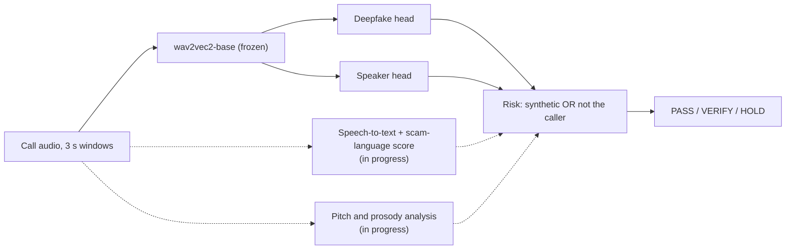
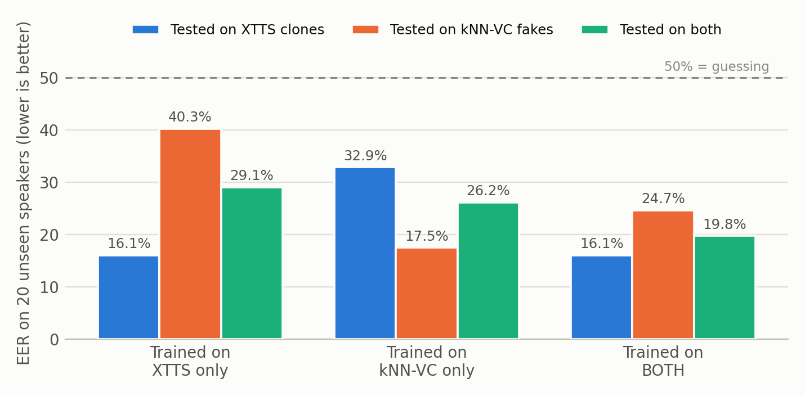
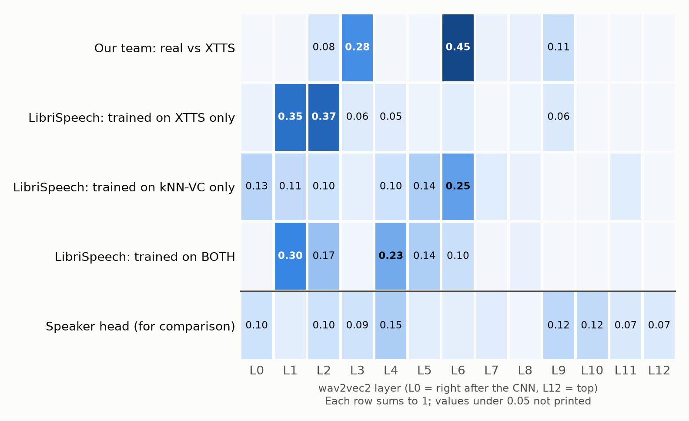

# SATYAVAANI

Real-time detection of AI voice clones on phone calls. Built by Team-Cognify for Smart India Hackathon, problem statement **SIH26104**: *AI-Powered Real-Time Detection and Prevention of Voice Cloning Impersonation Attacks* (Blockchain & Cybersecurity).

Every 3 seconds we run one pass of a frozen wav2vec2 model over the call audio and feed it to two small heads. One asks *is this voice synthetic?*, the other asks *is this really the person on the caller ID?* Together they give one risk score: **PASS**, **VERIFY** or **HOLD**.



Dashed lines are the parts we're still building.

## Working now, and in progress

| Part | What it answers | Status |
|---|---|---|
| Deepfake head | Is this voice made by AI? | Working |
| Speaker head | Is this the person on the caller ID? | Working |
| Risk score, web app, REST API | PASS / VERIFY / HOLD every 3 seconds | Working |
| Scam-language score ("sentiment score") | Does what they're saying sound like a fraudster? | **In progress** |
| Pitch and prosody analysis | Does the voice move like a real person's? | **In progress** |

### Scam-language score (in progress)

A speech-to-text step turns the call into words, and a text model scores how likely those sentences are to come from a fraudster: urgency ("right now"), secrecy ("don't tell anyone"), requests for money, UPI transfers or OTPs, and claims of authority ("I'm calling from your bank"). A cloned voice can sound perfect, but the scammer still has to ask for the money.

Today the app's call-context options (unknown number, asks for money or an OTP, urgent or secret request) are ticked by hand. This score will set them automatically from what's actually said. Like the other signals it can only raise the risk, and the words will be scored on the fly, not stored. We're starting with English and Hindi.

### Pitch and prosody analysis (in progress)

This tracks how pitch rises and falls, how fast someone talks, where they pause and how loudness changes across the call. Cloning tools copy how a voice sounds but can get how it moves wrong: too flat, too regular, or emotion that doesn't fit the words. It also helps a genuinely scared caller read as human rather than suspicious.

It will join the risk score as a third signal, under the same rule: any signal can raise the risk, and none can lower what another has found.

Neither of these has results yet, so every number below comes from the two working heads. More detail is in section 8 of the [findings report](docs/SATYAVAANI_experimental_findings.pdf).

## Results

| | |
|---|---|
| Deepfake detection on a teammate the model never heard | **4.6% ± 3.3% EER** (4.7% on phone-line audio) |
| At the app's threshold | 94.7% of clones caught, 7.1% of real voices flagged |
| Speaker check on our team | 10.9% EER |
| XTTS clones that fool the speaker check alone, over a phone line | 43%, which is why we need both heads |
| Trained on one generator (XTTS), tested on another (kNN-VC) | ~40% EER, our main open problem |
| Trained on both generators (LibriSpeech, 20 unseen speakers) | kNN-VC drops from 40.3% to 24.7% EER |
| Time per 3 s window, RTX 5050 laptop GPU | 18.3 ms |

Everything we tried, including what didn't work, is written up in [docs/SATYAVAANI_experimental_findings.pdf](docs/SATYAVAANI_experimental_findings.pdf).



Which wav2vec2 layers each deepfake head learned to rely on. Each generator leaves its traces at a different depth:



## Run it

```powershell
python -m venv .venv
.venv\Scripts\Activate.ps1
pip install torch torchaudio --index-url https://download.pytorch.org/whl/cu128
pip install -r requirements.txt

python app.py          # http://127.0.0.1:7860
python api_server.py   # http://127.0.0.1:8000/docs
```

The trained heads are in `models/`, and wav2vec2-base downloads on first run. You can upload a recording, use the live microphone, or enrol new voices. The built-in demo calls need our team's recordings, which aren't in this repo.

## Train it on your own voices

Put your phone recordings in `raw/`, describe who read what in `SPEAKERS` at the top of `sv_audio.py`, then:

```powershell
python pipeline/step1_prep.py        # clean the recordings
python pipeline/step2_clone.py       # XTTS-v2 clone of every sentence
python pipeline/step3_features.py    # wav2vec2 features, same augmentation for real and fake
python pipeline/step4_deepfake.py    # leave-one-speaker-out training and test
python pipeline/step5_speaker.py     # enrol voiceprints and test the speaker check
python pipeline/measure_latency.py
```

The speaker head was trained separately on LibriSpeech train-clean-100 (`ref_code/train_speaker.py`).

## What's where

```
app.py, api_server.py     the web app and the REST API
sv_*.py                   audio processing, models, scoring engine, UI pieces
pipeline/                 steps 1-5 and the latency test
experiments/              LibriSpeech generalisation, two generators, voiceprint comparison
tools/                    export layer weights, redraw the layer chart
models/                   trained heads (see models/README.md)
reports/, libri_exp/      results as JSON
docs/                     findings report and charts
```

## Not in this repo

- **Our teammates' recordings, their AI clones and their voiceprints.** Real voices of named people next to working clones of them is exactly what an impersonator would want.
- **Features, LibriSpeech audio and generated clips.** They're big and can be rebuilt. LibriSpeech is at [openslr.org/12](https://www.openslr.org/12).
- **Third-party models.** [wav2vec2-base](https://huggingface.co/facebook/wav2vec2-base) (Apache-2.0), [XTTS-v2](https://huggingface.co/coqui/XTTS-v2) (Coqui Public Model License, non-commercial) and [kNN-VC](https://github.com/bshall/knn-vc) (MIT) download from their own sources.

## Known limitations

- Six speakers is small, so per-speaker results vary a lot.
- A detector trained on one clone generator mostly misses others. Training on two helps but raises false alarms (25% at the default threshold), and it still needs testing on a third generator it has never seen.
- The speaker head learned from English audiobooks, so its threshold had to be retuned for Indian-accented phone speech.
