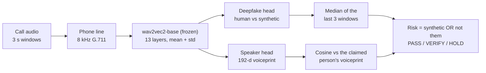

# SATYAVAANI

**Real-time detection of AI voice clones on live calls.** Smart India Hackathon, problem statement 21064.

Every 3 seconds, one pass of a frozen wav2vec2 encoder feeds two small heads:

- a **deepfake head**: is this voice synthetic?
- a **speaker head**: is it really the person the caller ID claims?

The two answers are fused into one risk score: **PASS** (under 45), **VERIFY** (45–75) or **HOLD** (75 and up).



## Results

| What we measured | Result |
|---|---|
| Deepfake detection on a teammate never seen in training (6-fold leave-one-speaker-out) | **4.6% ± 3.3% EER** |
| Same, phone-line (G.711) audio only | **4.7% EER** |
| At the operating threshold | **94.7%** of clones caught, **7.1%** of real voices flagged |
| Pause-only shortcut check (≈ 50% means pauses carry no clue) | 37.5% (10.6% before we fixed it) |
| Speaker verification on our team (never trained on) | 10.9% EER with phone-line voiceprints |
| XTTS clones that fool the voice check alone over a phone line | 43% (why both heads are needed) |
| Trained on XTTS, tested on an unseen generator (kNN-VC) | ~40% EER: the main open problem |
| Trained on XTTS **and** kNN-VC (LibriSpeech, 20 unseen speakers) | kNN-VC 40.3% → **24.7%**, XTTS unchanged at 16.1% |
| Latency per 3 s window, both heads, one encoder pass | **18.3 ms** on an RTX 5050 laptop GPU (164× faster than real time) |

The full write-up of every experiment is in [docs/SATYAVAANI_experimental_findings.pdf](docs/SATYAVAANI_experimental_findings.pdf).


## Quick start

Tested on Windows 11 with an RTX 5050 Laptop GPU (8 GB) and Python 3.10 or newer.

```powershell
python -m venv .venv
.venv\Scripts\Activate.ps1
pip install torch torchaudio --index-url https://download.pytorch.org/whl/cu128   # GPU build; see requirements.txt
pip install -r requirements.txt

python app.py          # web app at http://127.0.0.1:7860
python api_server.py   # REST API at http://127.0.0.1:8000/docs
```

The trained heads are in `models/`, and `facebook/wav2vec2-base` downloads on first run.

What works out of the box:

- **Upload** a recording, or use the **live microphone**.
- **Enrol** a voice from 10–20 s of speech; only 192 numbers are stored.
- Score files through the **API**.

The ready-made demo calls need our team's recordings, which are not in this repository (see below).

### REST API

| Endpoint | What it does |
|---|---|
| `POST /v1/score` | score an audio file (optional `claimed_id`) |
| `POST /v1/enroll` | add a voiceprint |
| `GET /v1/voiceprints` | list enrolled voices |
| `GET /v1/health` | health check |

## How the risk is computed

- `p_synth`: the deepfake head's probability, calibrated with Platt scaling on out-of-fold scores. The median of the last three windows is used, so one odd window (a laugh, a shout) can't flip the call.
- `p_imp = sigmoid(15 × (threshold − cosine))` between the speaker's running voiceprint and the claimed person's. It is only used after 4 s of speech.
- `risk = 1 − (1 − p_synth)(1 − p_imp)`: synthetic OR not the claimed person. A voice match never lowers the risk.
- Adjustments:
  - Call context raises the prior: unknown number, money/OTP request, urgency.
  - The risk is smoothed from window to window.
  - Silent windows hold the score.
  - Windows under 40% speech are skipped by an energy VAD.
- The live microphone goes through an 8 kHz G.711 phone line before scoring. Voiceprints are built from the same channel, and half of the training audio went through it too.

## Train it on your own voices

1. Put phone recordings in `raw/`. Record 30 sentences per person from `sentences/`, plus a ~40 s reference passage each.
2. Describe who read which files in the `SPEAKERS` table at the top of `sv_audio.py`.
3. Run the pipeline:

```powershell
python step1_prep.py        # sort, trim and normalise recordings  -> data/real, data/ref
python step2_clone.py       # XTTS-v2 clone of every sentence       -> data/xtts
python step3_features.py    # wav2vec2 features, same augmentation for real and fake
python step4_deepfake.py    # 6-fold leave-one-speaker-out training  -> models/deepfake, reports/deepfake_loso.json
python step5_speaker.py     # phone-line voiceprints + speaker test  -> models/voiceprints.npz, reports/speaker_test.json
python measure_latency.py   # -> reports/latency.json
```

The speaker head was trained separately on LibriSpeech train-clean-100. The original training script is kept in `ref_code/` for reference; its paths point to our machine.

### Experiments

| Script | Question it answers |
|---|---|
| `libri_generalization.py` | Does a head trained on XTTS clones of 70 LibriSpeech speakers catch kNN-VC fakes of 20 unseen speakers? How does background noise level change that? |
| `libri_two_generators.py` | What changes when the head is trained on XTTS and kNN-VC together? |
| `compare_voiceprints.py` | Should voiceprints be built from clean audio, phone-line audio, or both? |

Result summaries are in `reports/` and `libri_exp/`.

## Files

| File | What it is |
|---|---|
| `sv_audio.py` | paths, team table, audio loading, trimming, pause gating, noise, phone line, windows, VAD, streaming resampler |
| `sv_heads.py` | numpy speaker-head forward pass, voiceprints, EER, calibration |
| `sv_models.py` | wav2vec2 encoder, deepfake head and its training, model loaders |
| `sv_engine.py` | live scoring: buffer → window → one encoder pass → both heads → fused risk |
| `sv_views.py` | HTML/SVG pieces of the app (risk ring, timeline, layer chart) |
| `app.py`, `api_server.py` | Gradio app and FastAPI server |
| `step1`–`step5`, `measure_latency.py` | the training and evaluation pipeline, in order |
| `models/` | trained heads (see `models/README.md`) |
| `docs/` | the experimental findings report and charts |

## What is not in this repository, and why

- **Our team's recordings, reference passages and their AI clones** (`raw/`, `data/`). Voice samples plus working clones of named people are exactly what an impersonator needs, so they stay private.
- **Our team's voiceprints** (`models/voiceprints.npz`). These are biometric data.
- **Features, LibriSpeech audio and generated LibriSpeech clones.** They are large and can be regenerated. LibriSpeech is available at [openslr.org/12](https://www.openslr.org/12) (CC BY 4.0).
- **Third-party models.** They download from their own sources on first use:
  - [wav2vec2-base](https://huggingface.co/facebook/wav2vec2-base) (Apache-2.0)
  - [XTTS-v2](https://huggingface.co/coqui/XTTS-v2) (Coqui Public Model License, non-commercial)
  - [kNN-VC](https://github.com/bshall/knn-vc) (MIT)

## Limitations

- **Six speakers.** Per-speaker results vary a lot (± 3.3 points).
- **Unseen generators.** A head trained on one generator learns that generator's fingerprint and drops to about 40% EER on a different one. Training on two generators helps, but it raises false alarms (25% at the default threshold), and it still has to be tested on a third generator kept out of training.
- **Speaker head domain.** The speaker head was trained on English audiobooks. On Indian-accented phone speech its threshold had to be retuned on the team's own data.
